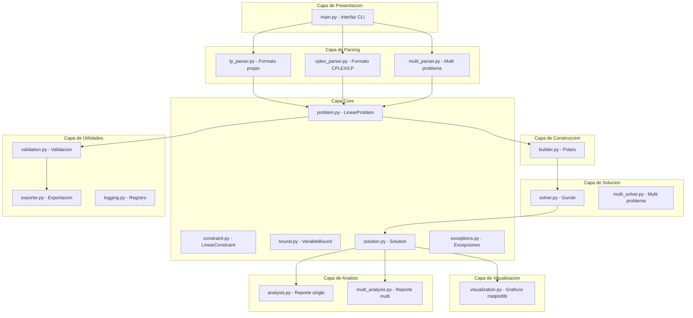
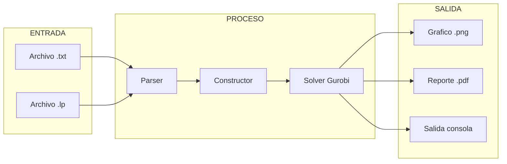

# Gurobipy-Simplex-General-Solver

## Resumen del Proyecto

Gurobipy-Simplex-General-Solver es un sistema profesional para resolver problemas de Programacion Lineal (PL). El sistema combina el Metodo Simplex clasico con el optimizador comercial Gurobi, ofreciendo capacidades completas de visualizacion grafica y generacion de informes academicos en formato PDF.

Esta herramienta esta disenada especificamente para uso educativo y de practica, permitiendo a estudiantes y profesionales aprender y aplicar conceptos de programacion lineal de manera practica.

---

## Tabla de Contenidos

1. Arquitectura del Sistema
2. Requisitos del Sistema
3. Instalacion
4. Uso desde Linea de Comandos
5. Formato de Archivos de Problemas
6. Estructura del Proyecto
7. Descripcion Tecnica de Modulos
8. Clases y Funciones Principales
9. Analisis de Sensibilidad
10. Diagnostico de Infactibilidad
11. Configuracion del Solucionador
12. Informe PDF
13. Formato CPLEX/LP
14. Validacion de Problemas
15. Licencia
16. Version

---

## 1. Arquitectura del Sistema

### 1.1 Diagrama de Componentes



### 1.2 Flujo de Datos



### 1.3 Capas del Sistema

| Capa | Componente | Descripcion |
|------|-----------|-------------|
| Presentacion | main.py | Interfaz CLI que gestiona argumentos y coordina ejecucion |
| Visualizacion | visualization.py | Genera graficos de regiones factibles 2D |
| Analisis | analysis.py, multi_analysis.py | Crea reportes PDF academicos |
| Solucion | solver.py, multi_solver.py | Implementa optimizacion con Gurobi |
| Construccion | matrix/builder.py | Convierte a estructuras Polars |
| Parsing | lp_parser.py, cplex_parser.py, multi_parser.py | Interpreta archivos de entrada |
| Core | problem.py, constraint.py, bound.py, solution.py | Define estructuras fundamentales |
| Utilidades | validation.py, exporter.py, logging.py | Funciones auxiliares |

---

## 2. Requisitos del Sistema

| Requisito | Version Minima | Descripcion |
|-----------|---------------|-------------|
| Python | 3.14 o superior | Lenguaje de programacion utilizado |
| Gurobi | 13.0 o superior | Optimizador comercial requerido |
| Memoria RAM | 4 GB minimo (8 GB recomendado) | Para ejecutacion del solver |
| Espacio en disco | 500 MB | Para instalacion de dependencias |

### Dependencias del Entorno

| Paquete | Version | Proposito |
|---------|---------|-----------|
| gurobipy | >=13.0.1 | Optimizador comercial de PL/MILP |
| polars | >=1.39.0 | DataFrames de alto rendimiento |
| matplotlib | >=3.9.0 | Generacion de graficos 2D |
| numpy | >=2.4.3 | Computacion numerica |
| fpdf2 | >=2.7.0 | Generacion de documentos PDF |
| reportlab | >=4.4.10 | Generacion avanzada de PDFs |

---

## 3. Instalacion

### Paso 1: Clonar el Repositorio

```
git clone <repositorio-url>
cd gurobipy-simplex-general-solver
```

### Paso 2: Instalar Dependencias

```
pip install gurobipy polars matplotlib numpy fpdf2 reportlab
```

Tambien puede utilizarse Poetry:

```
poetry install
```

### Paso 3: Configurar Licencia de Gurobi

Gurobi requiere una licencia valida para funcionar. Obtener una licencia academica gratuita en gurobipy.com/academic o contactar a Gurobi para licencias comerciales.

Configurar la licencia con:

```
grbgetkey TU_CLAVE_DE_LICENCIA
```

---

## 4. Uso desde Linea de Comandos

### Comandos Basicos

| Comando | Descripcion |
|--------|-------------|
| python main.py problema.txt | Resuelve un problema simple |
| python main.py problema.txt --visualize | Resuelve y genera grafico |
| python main.py problema.txt --pdf | Resuelve y genera informe PDF |
| python main.py problema.txt --verbose | Resuelve con salida detallada |
| python main.py problema.txt --times | Muestra tiempos de ejecucion |
| python main.py problema.txt --multi | Resuelve multiples problemas |

### Flags CLI Disponibles

| Flag | Alias | Descripcion |
|------|------|-------------|
| --multi | -m | Activa el modo multi-problema |
| --visualize | -v | Genera visualizacion grafica |
| --pdf | -p | Genera reporte academico PDF |
| --times | -t | Muestra tiempos de ejecucion |
| --verbose | -V | Salida detallada del solver |

### Combinaciones

Los comandos pueden combinarse para obtener multiples salidas:

```
python main.py problema.txt --visualize --pdf --times --verbose
```

### Ejemplos de Salida

#### Resolucion Simple

```
python main.py data/problem.txt
```

Salida esperada:

```
Valor optimo: 30000.00
x = 30.00
y = 20.00
```

#### Multiples Problemas

```
python main.py data/problem_multi.txt --multi
```

Salida esperada:

```
==================================================
MODO MULTI-PROBLEMA
==================================================
Problemas encontrados: 2

--- Problema 1 ---
Estado: OPTIMAL
Valor optimo: 11.4286
Variables: x=-1.14, y=2.57
Tiempo: 15.23 ms

--- Problema 2 ---
Estado: OPTIMAL
Valor optimo: 36.0000
Variables: x=2.00, y=6.00
Tiempo: 12.45 ms

Problemas resueltos: 2/2
```

---

## 5. Formato de Archivos de Problemas

### Funcion Objetivo

La funcion objetivo debe comenzar con "max:" o "min:" seguido de la expresion matematica.

Ejemplos:

```
max: 3000x + 5000y
min: 2x + 3y + 5z
```

### Restricciones

Las restricciones se expresan utilizando los simbolos de comparacion.

Ejemplos:

```
x + y <= 100         (menor o igual)
2x + 3y >= 50       (mayor o igual)  
x + y = 75           (igual)
```

### Limites de Variables

Los limites definen el rango de valores que puede tomar cada variable.

Ejemplos:

```
x >= 0                (limite inferior)
y <= 50               (limite superior)
x free                (variable libre, sin limites)
0 <= x <= 100         (ambos limites simultaneamente)
```

### Comentarios

Las lineas que comienzan con el simbolo # son tratadas como comentarios y son ignoradas por el parser.

Ejemplo:

```
# Este es un comentario explicativo
max: 3x + 2y

# Restriccion de capacidad
x + y <= 10
```

### Multiple Problemas

Para definir multiples problemas en un archivo, utilize delimitadores:

```
max: 3x + 2y

x + y <= 10
2x + y <= 15

x >= 0
y >= 0

---

max: 4x + 3y

x <= 5
y <= 8

x >= 0
y >= 0
```

Delimitadores soportados: ---, ===, ___

---

## 6. Estructura del Proyecto

```
gurobipy-simplex-general-solver/
├── main.py                              # Punto de entrada CLI
├── pyproject.toml                       # Configuracion del proyecto
├── README.md                          # Documentacion principal
├── LICENSE                            # Licencia MIT
├── CONTRIBUTING.md                  # Guia de contribuciones
├── CHANGELOG.md                     # Historial de cambios
├── data/
│   ├── problem.txt                  # Problema de ejemplo
│   ├── problem_multi.txt          # Multiples problemas
│   ├── problem.png              # Grafico generado
│   └── problem.pdf              # Reporte PDF generado
├── src/
│   ├── __init__.py                # Exports publicos
│   ├── parser/
│   │   ├── __init__.py
│   │   ├── lp_parser.py         # Parser formato propio
│   │   ├── cplex_parser.py    # Parser CPLEX/LP
│   │   └── multi_parser.py   # Parser multi-problema
│   ├── core/
│   │   ├── __init__.py
│   │   ├── problem.py        # LinearProblem
│   │   ├── constraint.py     # LinearConstraint
│   │   ├── bound.py          # VariableBound
│   │   ├── solution.py       # Solution
│   │   └── exceptions.py   # Excepciones custom
│   ├── matrix/
│   │   ├── __init__.py
│   │   ├── builder.py        # Constructor Polars
│   │   └── matrix.py        # Tipos PolarsLP
│   ├── solver/
│   │   ├── __init__.py
│   │   ├── solver.py         # SolverLP
│   │   └── multi_solver.py  # MultiSolver
│   ├── utils/
│   │   ├── __init__.py
│   │   ├── validation.py    # Validacion de entrada
│   │   ├── exporter.py     # Exportacion LP
│   │   └── logging.py      # Utilidades de registro
│   ├── visualization/
│   │   ├── __init__.py
│   │   └── visualization.py # Graficos 2D
│   └── analysis/
│       ├── __init__.py
│       ├── analysis.py       # Reporte single
│       └── multi_analysis.py  # Reporte multi
└── legacy/                      # Contenido legacy
    ├── Simplex.py
    └── Opinion.md
```

---

## 7. Descripcion Tecnica de Modulos

### 7.1 Modulo Principal (main.py)

**Ubicacion**: main.py

**Proposito**: Punto de entrada de la aplicacion CLI que gestiona los argumentos de linea de comandos y coordina la ejecucion en modo single o multi-problema.

**Funciones**:

| Funcion | Firma | Descripcion |
|---------|-------|-------------|
| main | main(argv: list[str] \| None = None) -> None | Funcion principal que parsea argumentos y ejecuta el flujo apropiado |
| _run_multi | _run_multi(text: str, path: Path, visualize: bool, pdf: bool, times: bool, verbose: bool) -> None | Ejecuta el modo multi-problema |
| _run_single | _run_single(text: str, path: Path, visualize: bool, pdf: bool, times: bool, verbose: bool) -> None | Ejecuta el modo single-problema |

### 7.2 Modulo de Parsing (src/parser/)

#### 7.2.1 Parser LP Individual (lp_parser.py)

**Ubicacion**: src/parser/lp_parser.py

**Proposito**: Parsea problemas de programacion lineal definidos en texto plano a objetos LinearProblem.

**Clase Principal**: LPParser

**Atributos**:

| Atributo | Tipo | Descripcion |
|----------|------|-------------|
| txt | str | Texto con la definicion del problema LP |
| bounds | dict[str, VariableBound] | Diccionario de limites de variables |

**Metodos**:

| Metodo | Firma | Complejidad | Descripcion |
|--------|-------|-------------|-------------|
| parse | parse() -> LinearProblem | O(n×m) | Parsea el texto y retorna el problema |
| _parse_objective | _parse_objective(line: str) -> tuple[str, dict[str, float]] | O(m) | Parsea la funcion objetivo |
| _parse_constraint | _parse_constraint(line: str) -> LinearConstraint | O(m) | Parsea una restriccion |
| _parse_linear_expression | _parse_linear_expression(expr: str) -> dict[str, float] | O(m) | Parsea expresion lineal |
| _is_bound | _is_bound(line: str) -> bool | O(1) | Verifica si es un bound |
| _parse_bound | _parse_bound(line: str) -> None | O(1) | Parsea un bound |
| _extract_variables | _extract_variables(...) -> list[str] | O(n×m) | Extrae nombres de variables |

**Excepciones**: LPParseError para formato invalido

#### 7.2.2 Parser CPLEX/LP (cplex_parser.py)

**Ubicacion**: src/parser/cplex_parser.py

**Proposito**: Parsea problemas en formato LP estandar de CPLEX.

**Clase Principal**: CPLEXParser

**Metodos**:

| Metodo | Firma | Descripcion |
|--------|-------|-------------|
| parse | parse() -> LinearProblem | Parsea archivo formato CPLEX/LP |
| _parse_section | _parse_section(lines: list[str], section: str) -> dict | Parsea una seccion del archivo |
| _normalize_sense | _normalize_sense(sense: str) -> str | Normaliza el sentido de optimizacion |

**Secciones Soportadas**:

| Seccion | Descripcion |
|--------|-------------|
| Objective | Funcion objetivo |
| Constraints | Restricciones |
| Bounds | Limites de variables |
| General | Constraints generale |

#### 7.2.3 Parser Multi-Problema (multi_parser.py)

**Ubicacion**: src/parser/multi_parser.py

**Proposito**: Parsea multiples problemas de LP desde un unico archivo usando delimitadores.

**Clase Principal**: MultiLPParser

**Constantes**:

```
DELIMITERS = ['---', '===', '___']
```

**Metodos**:

| Metodo | Firma | Descripcion |
|--------|-------|-------------|
| parse_all | parse_all() -> List[LinearProblem] | Parsea todos los problemas |
| _split_by_delimiter | _split_by_delimiter(txt: str) -> List[str] | Divide el texto usando delimitadores |
| count_problems | count_problems(txt: str) -> int | Cuenta problemas sin parsear |

### 7.3 Modulo Core (src/core/)

#### 7.3.1 Modelo de Problema (problem.py)

**Ubicacion**: src/core/problem.py

**Clase Principal**: LinearProblem (dataclass)

**Atributos**:

| Atributo | Tipo | Descripcion |
|----------|------|-------------|
| objective | dict[str, float] | Coeficientes de la funcion objetivo |
| sense | str | Direccion de optimizacion ("max" o "min") |
| constraints | list[LinearConstraint] | Lista de restricciones lineales |
| variables | list[str] | Lista de nombres de variables |
| bounds | dict[str, VariableBound] | Limites de cada variable |
| name | str | Nombre opcional del problema |

#### 7.3.2 Restricciones (constraint.py)

**Ubicacion**: src/core/constraint.py

**Clase Principal**: LinearConstraint (dataclass)

**Atributos**:

| Atributo | Tipo | Descripcion |
|----------|------|-------------|
| coefficients | dict[str, float] | Coeficientes de las variables |
| rhs | float | Lado derecho de la restriccion |
| sense | str | Tipo de restriccion ("<=", ">=", "=") |

#### 7.3.3 Limites de Variables (bound.py)

**Ubicacion**: src/core/bound.py

**Clase Principal**: VariableBound (dataclass)

**Atributos**:

| Atributo | Tipo | Descripcion |
|----------|------|-------------|
| variable | str | Nombre de la variable |
| lower | float \| None | Limite inferior |
| upper | float \| None | Limite superior |

#### 7.3.4 Solucion (solution.py)

**Ubicacion**: src/core/solution.py

**Clase Principal**: Solution (dataclass)

**Atributos**:

| Atributo | Tipo | Descripcion |
|----------|------|-------------|
| status | str | Estado de la solucion ("OPTIMAL", "INFEASIBLE", "UNBOUNDED") |
| objective_value | float \| None | Valor optimo de la funcion objetivo |
| variables | dict[str, float] | Valores de las variables en la solucion |
| dual_values | dict[str, float] | Valores duales (precios sombra) |
| reduced_costs | dict[str, float] | Costos reducidos |
| iterations | int | Numero de iteraciones del solver |
| nodes | int | Numero de nodos explorados |

**Metodos**:

| Metodo | Firma | Descripcion |
|--------|-------|-------------|
| is_optimal | is_optimal() -> bool | Verifica si el estado es OPTIMAL |
| is_infeasible | is_infeasible() -> bool | Verifica si el estado es INFEASIBLE |
| is_unbounded | is_unbounded() -> bool | Verifica si el estado es UNBOUNDED |

#### 7.3.5 Excepciones (exceptions.py)

**Ubicacion**: src/core/exceptions.py

**Excepciones Definidas**:

| Excepcion | Descripcion |
|-----------|-------------|
| LPError | Excepcion base para errores de PL |
| LPParseError | Error al parsear un problema |
| LPValidationError | Error de validacion |
| LPSolverError | Error del solver |
| LPFormatError | Error de formato |

### 7.4 Modulo Matrix (src/matrix/)

#### 7.4.1 Constructor de Matrices (builder.py)

**Ubicacion**: src/matrix/builder.py

**Proposito**: Construye estructuras de datos Polars (DataFrames) para representar el problema LP.

**Clase Principal**: LPBuilder

**Metodos**:

| Metodo | Firma | Descripcion |
|--------|-------|-------------|
| build | build() -> PolarsLP | Construye el objeto PolarsLP con DataFrames |
| _build_objective | _build_objective() -> pl.DataFrame | Construye DataFrame objetivo |
| _build_constraints | _build_constraints() -> pl.DataFrame | Construye DataFrame restricciones |
| _build_coefficients | _build_coefficients() -> pl.DataFrame | Construye matriz de coeficientes |
| _build_bounds | _build_bounds() -> pl.DataFrame | Construye DataFrame limites |

#### 7.4.2 Tipos de Matrices (matrix.py)

**Ubicacion**: src/matrix/matrix.py

**Clase Principal**: PolarsLP (dataclass)

**Atributos**:

| Atributo | Tipo | Descripcion |
|----------|------|-------------|
| objective | pl.DataFrame | DataFrame con coeficientes objetivo |
| constraints | pl.DataFrame | DataFrame con restricciones |
| coefficients | pl.DataFrame | DataFrame con matriz de coeficientes |
| bounds | pl.DataFrame | DataFrame con limites de variables |
| sense | str | Sentido de optimizacion |

### 7.5 Modulo Solver (src/solver/)

#### 7.5.1 Solver Gurobi (solver.py)

**Ubicacion**: src/solver/solver.py

**Proposito**: Resuelve problemas LP utilizando el optimizador Gurobi.

**Clase Principal**: SolverLP

**Atributos**:

| Atributo | Tipo |_descripcion |
|----------|------|-------------|
| lp | PolarsLP | Estructura PolarsLP con el problema |
| config | SolverConfig | Configuracion del solver |

**Metodos**:

| Metodo | Firma | Complejidad | Descripcion |
|--------|-------|-------------|-------------|
| solve | solve() -> Solution | O(n³) tipico | Resuelve el problema y retorna solucion |
| _build_model | _build_model(model: gp.Model) -> None | O(m×n) | Construye el modelo Gurobi |
| _extract_solution | _extract_solution(model: gp.Model) -> Solution | O(n) | Extrae la solucion del modelo |
| _compute_iis | _compute_iis(model: gp.Model) -> list[str] | O(n) | Calcula conjunto infactible irreducible |

**Estados de Solucion**:

| Estado | Descripcion |
|--------|-------------|
| OPTIMAL | Solucion optima encontrada |
| INFEASIBLE | El problema no tiene region factible |
| UNBOUNDED | La funcion objetivo puede crecer sin limite |
| OPTIMAL + IIS | Solucion optima con diagnostico IIS |
| STATUS_* | Otro estado de Gurobi |

#### 7.5.2 Solver Multi-Problema (multi_solver.py)

**Ubicacion**: src/solver/multi_solver.py

**Clases Principales**:

| Clase | Descripcion |
|-------|-------------|
| ProblemResult | Dataclass para resultado de un problema |
| MultiSolverResult | Dataclass para resultados multiples |
| MultiSolver | Solver para multiples problemas |

**Metodos de MultiSolver**:

| Metodo | Firma | Descripcion |
|--------|-------|-------------|
| solve_all | solve_all(problems: List[LinearProblem]) -> MultiSolverResult | Resuelve todos los problemas |
| _solve_single | _solve_single(problem: LinearProblem, index: int) -> ProblemResult | Resuelve un problema individual |
| solve_from_text | solve_from_text(text: str) -> MultiSolverResult | Parsea y resuelve desde texto |

#### 7.5.3 Configuracion del Solver (solver.py - SolverConfig)

**Ubicacion**: src/solver/solver.py

**Clase Principal**: SolverConfig (dataclass)

**Atributos**:

| Atributo | Tipo | Descripcion | Default |
|----------|------|-------------|---------|
| verbose | bool | Salida detallada | False |
| time_limit | float | Limite de tiempo (segundos) | inf |
| threads | int | Numero de hilos | 0 (automatico) |
| method | int | Metodo de optimizacion | -1 (automatico) |
| mip_gap | float | Tolerancia de gap MIP | 1e-4 |
| presolve | int | Nivel de presolve | 2 (automatico) |
| heuristics | float | Porcentaje de heuristicas | 0.05 |

**Constantes de Metodos**:

| Constante | Valor | Descripcion |
|-----------|-------|-------------|
| METHOD_AUTO | -1 | Automtico |
| METHOD_PRIMAL | 0 | Simplex primal |
| METHOD_DUAL | 1 | Simplex dual |
| METHOD_BARRIER | 2 | Metodo de barrera |
| METHOD_CONCURRENT | 3 | Metodo concurrente |

### 7.6 Modulo de Utilidades (src/utils/)

#### 7.6.1 Validacion (validation.py)

**Ubicacion**: src/utils/validation.py

**Proposito**: Valida problemas de programacion lineal antes deresolverlos.

**Clase Principal**: LPValidator

**Metodos**:

| Metodo | Firma | Descripcion |
|--------|-------|-------------|
| validate | validate(problem: LinearProblem) -> ValidationResult | Valida un problema |
| _validate_objective | _validate_objective(problem: LinearProblem) -> list[str] | Valida funcion objetivo |
| _validate_constraints | _validate_constraints(problem: LinearProblem) -> list[str] | Valida restricciones |
| _validate_bounds | _validate_bounds(problem: LinearProblem) -> list[str] | Valida limites |

**Clase de Resultado**: ValidationResult

| Atributo | Tipo | Descripcion |
|----------|------|-------------|
| is_valid | bool | Indica si el problema es valido |
| errors | list[str] | Lista de errores encontrados |
| warnings | list[str] | Lista de advertencias |

#### 7.6.2 Exportacion (exporter.py)

**Ubicacion**: src/utils/exporter.py

**Proposito**: Exporta problemas al formato LP estandar de CPLEX.

**Clase Principal**: LPExporter

**Metodos**:

| Metodo | Firma | Descripcion |
|--------|-------|-------------|
| export | export(problem: LinearProblem) -> str | Exporta problema a formato LP |
| _format_objective | _format_objective(obj: dict, sense: str) -> str | Formatea funcion objetivo |
| _format_constraints | _format_constraints(constraints: list) -> str | Formatea restricciones |
| _format_bounds | _format_bounds(bounds: dict) -> str | Formatea limites |

#### 7.6.3 Registro (logging.py)

**Ubicacion**: src/utils/logging.py

**Proposito**: Proporciona utilidades de registro y medicion de tiempos.

**Clase Principal**: ExecutionTimes

**Atributos**:

| Atributo | Tipo | Descripcion |
|----------|------|-------------|
| parse_time | float | Tiempo de parseo |
| build_time | float | Tiempo de construccion |
| solve_time | float | Tiempo de resolucion |
| visualize_time | float | Tiempo de visualizacion |
| pdf_time | float | Tiempo de generacion PDF |

**Metodos**:

| Metodo | Firma | Descripcion |
|--------|-------|-------------|
| total | total() -> float | Tiempo total de ejecucion |
| summary | summary() -> str | Resumen formateado |

### 7.7 Modulo de Visualizacion (src/visualization/)

**Ubicacion**: src/visualization/visualization.py

**Proposito**: Genera representaciones graficas de la region factible para problemas de dos variables.

**Clase Principal**: LinearVisualization

**Atributos**:

| Atributo | Tipo | Descripcion |
|----------|------|-------------|
| problem | LinearProblem | El problema de programacion lineal |
| solution | Solution \| None | La solucion optima |
| var_x | str | Nombre de la primera variable |
| var_y | str | Nombre de la segunda variable |

**Metodos**:

| Metodo | Firma | Descripcion |
|--------|-------|-------------|
| find_intersection | find_intersection(c1, c2) -> Optional[tuple[float, float]] | Encuentra interseccion entre dos restricciones |
| is_point_feasible | is_point_feasible(x, y, constraints) -> bool | Verifica factibilidad de un punto |
| get_constraint_line_x | get_constraint_line_x(c, x_range) -> tuple[np.ndarray, np.ndarray] | Obtiene puntos para graficar restriccion |
| find_feasible_vertices | find_feasible_vertices() -> list[tuple[float, float]] | Encuentra vertices de la region factible |
| plot | plot(save_path: Optional[str] = None, show: bool = True) -> None | Genera la visualizacion completa |
| _calculate_plot_range | _calculate_plot_range() -> tuple[tuple[float, float], tuple[float, float]] | Calcula rango del grafico |
| _plot_constraints | _plot_constraints(ax, x_range) -> None | Grafica las rectas de restricciones |
| _plot_feasible_region | _plot_feasible_region(ax, x_range, y_range) -> None | Grafica la region factible |
| _plot_intersections | _plot_intersections(ax) -> None | Grafica puntos de interseccion |
| _plot_solution | _plot_solution(ax) -> None | Grafica la solucion optima |
| _plot_objective_contour | _plot_objective_contour(ax, opt_x, opt_y) -> None | Grafica lineas de nivel |

### 7.8 Modulo de Analisis (src/analysis/)

#### 7.8.1 Analisis Single (analysis.py)

**Ubicacion**: src/analysis/analysis.py

**Proposito**: Genera reportes academicos profesionales en formato PDF.

**Clases**:

| Clase | Descripcion |
|-------|-------------|
| ReporteAcademico | Clase base FPDF para reportes |
| LPAnalysis | Generador de reportes PDF para un problema |

**Constantes de Estilo**:

| Constante | Valor | Descripcion |
|-----------|-------|-------------|
| PAGE_WIDTH | 215.9 | mm (carta) |
| PAGE_HEIGHT | 279.4 | mm |
| MARGIN | 20 | mm |
| COLOR_PRIMARY | (0, 51, 102) | Azul oscuro |
| COLOR_SUCCESS | (0, 128, 0) | Verde |
| COLOR_ERROR | (200, 0, 0) | Rojo |

**Metodos de LPAnalysis**:

| Metodo | Firma | Descripcion |
|--------|-------|-------------|
| generate | generate(problem: LinearProblem, solution: Solution) -> None | Genera el PDF completo |
| _agregar_portada | _agregar_portada() -> None | Agrega portada |
| _agregar_resumen | _agregar_resumen() -> None | Agrega resumen ejecutivo |
| _agregar_datos | _agregar_datos() -> None | Agrega datos del problema |
| _agregar_solucion | _agregar_solucion() -> None | Agrega solucion optima |
| _agregar_holgura | _agregar_holgura() -> None | Agrega analisis de holgura |
| _agregar_sensibilidad | _agregar_sensibilidad() -> None | Agrega analisis de sensibilidad |
| _agregar_grafico | _agregar_grafico() -> None | Agrega grafico si aplica |

#### 7.8.2 Analisis Multi-Problema (multi_analysis.py)

**Ubicacion**: src/analysis/multi_analysis.py

**Proposito**: Genera reportes academicos para multiples problemas.

**Clases**:

| Clase | Descripcion |
|-------|-------------|
| ReporteAcademicoMulti | Clase base FPDF para reportes multi-problema |
| MultiLPAnalysis | Generador de reportes PDF para multiples problemas |

**Metodos de MultiLPAnalysis**:

| Metodo | Firma | Descripcion |
|--------|-------|-------------|
| generate | generate(result: MultiSolverResult) -> None | Genera el PDF multi-problema |
| _agregar_portada | _agregar_portada(result: MultiSolverResult) -> None | Agrega portada con estadisticas |
| _agregar_resumen | _agregar_resumen(result: MultiSolverResult) -> None | Agrega tabla de resultados |
| _agregar_problema | _agregar_problema(result: ProblemResult) -> None | Agrega pagina por problema |
| _calcular_holguras | _calcular_holguras(constraints, solution) -> dict | Calcula holguras y precios sombra |
| _build_grafico | _build_grafico(problem, solution) -> None | Genera grafico temporal |

---

## 8. Clases y Funciones Principales

### LinearProblem

**Ubicacion**: src/core/problem.py:7

**Descripcion**: Representa la definicion completa de un problema de programacion lineal.

**Atributos**:

| Atributo | Tipo | Descripcion |
|----------|------|-------------|
| objective | dict[str, float] | Coeficientes de la funcion objetivo |
| sense | str | Direccion de optimizacion ("max" o "min") |
| constraints | list[LinearConstraint] | Lista de restricciones lineales |
| variables | list[str] | Lista de nombres de variables |
| bounds | dict[str, VariableBound] | Limites de cada variable |
| name | str | Nombre opcional del problema |

### LinearConstraint

**Ubicacion**: src/core/constraint.py:6

**Descripcion**: Representa una ecuacion o inecuacion lineal.

**Atributos**:

| Atributo | Tipo | Descripcion |
|----------|------|-------------|
| coefficients | dict[str, float] | Coeficientes de las variables |
| rhs | float | Lado derecho de la restriccion |
| sense | str | Tipo de restriccion ("<=", ">=", "=") |

### VariableBound

**Ubicacion**: src/core/bound.py:5

**Descripcion**: Define los limites inferior y superior de una variable.

**Atributos**:

| Atributo | Tipo | Descripcion |
|----------|------|-------------|
| variable | str | Nombre de la variable |
| lower | float \| None | Limite inferior |
| upper | float \| None | Limite superior |

### Solution

**Ubicacion**: src/core/solution.py:5

**Descripcion**: Contiene el resultado de resolver un problema.

**Atributos**:

| Atributo | Tipo | Descripcion |
|----------|------|-------------|
| status | str | Estado de la optimizacion |
| objective_value | float \| None | Valor optimo de la funcion objetivo |
| variables | dict[str, float] | Valores de las variables |
| dual_values | dict[str, float] | Valores duales (precios sombra) |
| reduced_costs | dict[str, float] | Costos reducidos |
| iterations | int | Numero de iteraciones |
| nodes | int | Numero de nodos |

### SolverConfig

**Ubicacion**: src/solver/solver.py:50

**Descripcion**: Permite configurar el comportamiento del optimizador Gurobi.

**Atributos**:

| Atributo | Tipo | Descripcion | Default |
|----------|------|-------------|---------|
| verbose | bool | Salida detallada | False |
| time_limit | float | Limite de tiempo | inf |
| threads | int | Numero de hilos | 0 |
| method | int | Metodo de optimizacion | -1 |
| mip_gap | float | Tolerancia de gap | 1e-4 |
| presolve | int | Nivel de presolve | 2 |
| heuristics | float | Porcentaje de heuristicas | 0.05 |

### ValidationResult

**Ubicacion**: src/utils/validation.py:15

**Descripcion**: Contiene el resultado de validar un problema.

**Atributos**:

| Atributo | Tipo | Descripcion |
|----------|------|-------------|
| is_valid | bool | Indica si el problema es valido |
| errors | list[str] | Lista de errores |
| warnings | list[str] | Lista de advertencias |

### ExecutionTimes

**Ubicacion**: src/utils/logging.py:10

**Descripcion**: Almacena las metricas de tiempo de las diferentes etapas.

**Atributos**:

| Atributo | Tipo | Descripcion |
|----------|------|-------------|
| parse_time | float | Tiempo de parseo |
| build_time | float | Tiempo de construccion |
| solve_time | float | Tiempo de resolucion |
| visualize_time | float | Tiempo de visualizacion |
| pdf_time | float | Tiempo de generacion PDF |

---

## 9. Analisis de Sensibilidad

El sistema proporciona analisis de sensibilidad completo para ayudar a interpretar los resultados.

### Precios Sombra

**Descripcion**: Los precios sombra (tambien conocidos como valores duales) representan el cambio marginal en el valor optimo de la funcion objetivo cuando se relaja una restriccion por una unidad.

**Interpretacion**:
- Precio sombra positivo: mejorar el limite de esa restriccion beneficiaria el objetivo
- Precio sombra cero: la restriccion no esta limitando el objetivo
- Precio sombra negativo: aumentar el limite perjudica el objetivo

### Costos Reducidos

**Descripcion**: Los costos reducidos indican cuanto mejoraria el objetivo si una variable que actualmente esta en su limite inferior pudiera incrementarse.

**Interpretacion**:
- Costo reducido de cero: la variable ya esta en su valor optimo
- Costo reducido positivo: la variable necesita aumentar para mejorar el objetivo
- Costo reducido negativo: la variable necesita disminuir para mejorar el objetivo

### Holgura

**Descripcion**: La holgura (slack) representa la diferencia entre el lado derecho de una restriccion y el valor de la expresion evaluada en el punto optimo.

**Interpretacion**:
- Holgura de cero: la restriccion esta activa (limitante)
- Holgura positiva: hay recursos no utilizados
- Holgura negativa: la restriccion esta violada (no deberia ocurrir en solucion valida)

---

## 10. Diagnostico de Infactibilidad

Cuando un problema no tiene solucion factible, el sistema puede identificar el Conjunto Infactible Irreducible (IIS).

### Que es IIS?

El IIS es el subconjunto mas pequeno de restricciones que sigue siendo infactible. Eliminar cualquier restriccion del IIS haria el problema factible.

### Como se Utiliza

El diagnostico IIS se activa automaticamente cuando el problema es infactible. La salida incluye:

```
Estado: INFEASIBLE
Conjunto Infactible Irreducible (IIS):
- Restriccion 1: 2x + 3y <= 120
- Restriccion 2: x >= 50
- Bound: x <= 30
```

### Interpretacion

Las restriccioneslisted en el IIS estan en conflicto directo. Para hacer el problema factible, debe relajarse al menos una de estas restricciones.

---

## 11. Configuracion del Solucionador

El optimizador Gurobi puede configurarse para ajustar su comportamiento segun las necesidades del problema.

### Parametros Principales

| Parametro | Descripcion | Valores Posibles |
|-----------|-------------|----------------|
| verbose | Controla la cantidad de salida impresa | True, False |
| time_limit | Limite maximo de tiempo de ejecucion | float (segundos) |
| threads | Numero de hilos de CPU a utilizar | 0=automatico, 1=single, N=hilos |
| method | Algoritmo de optimizacion | -1=auto, 0=primal, 1=dual, 2=barrier |
| mip_gap | Tolerancia de gap para problemas enteros | float (0.0 a 1.0) |
| presolve | Nivel de presolve | -1=auto, 0=off, 1=conservative, 2=aggressive |
| heuristics | Porcentaje de tiempo en heuristicas | float (0.0 a 1.0) |

### Metodos de Optimizacion

| Metodo | Constante | Descripcion |
|--------|-----------|-------------|
| Automatico | -1 | Gurobi selecciona el mejor metodo |
| Simplex Primal | 0 | Metodo simplex primal |
| Simplex Dual | 1 | Metodo simplex dual |
| Barrera | 2 | Metodo de barrera interior |
| Concurrent | 3 | Multiple metodos en paralelo |

**Recomendacion**: El metodo automatico es recomendado para la mayoria de los casos ya que Gurobi selecciona la mejor opcion basandose en la estructura del problema.

---

## 12. Informe PDF

El sistema genera informes academicos profesionales que contienen analisis completo de cada problema resuelto.

### Contenido del Informe Single

El informe para un problema individual contiene las siguientes secciones principales:

1. **Portada**: Informacion general del problema
   - Tipo (maximizacion o minimizacion)
   - Numero de variables y restricciones
   - Fecha de generacion

2. **Resumen Ejecutivo**: Estado de la optimizacion
   - Valor optimo encontrado
   - Resumen de tiempos de ejecucion

3. **Datos del Problema**: Definicion del problema
   - Variables definidas
   - Funcion objetivo
   - Tabla completa de restricciones

4. **Solucion Optima**: Resultados
   - Valores de todas las variables
   - Analisis de costos reducidos

5. **Analisis de Holgura y Precios Sombra**: Analisis de factibilidad
   - Holgura de cada restriccion
   - Precio sombra correspondiente
   - Indicacion de restricciones activas

6. **Analisis de Sensibilidad**: Interpretacion de resultados
   - Interpretacion de precios sombra
   - Recomendaciones para analisis adicional

7. ** Grafico**: Representacion visual (para 2 variables)
   - Region factible
   - Restricciones
   - Vertices
   - Punto optimo

### Informe Multi-Problema

Cuando se resuelven multiples problemas, el PDF contiene：

1. **Portada con Estadisticas**: Resumen general
   - Numero de problemas resueltos
   - Estadisticas globales

2. **Resumen Ejecutivo**: Tabla de resultados
   - Estado de cada problema
   - Valor optimo de cada uno

3. **Pagina por Problema**: Todas las secciones mencionadas
   - Con grafico individual si aplica

4. **Resumen de Tiempos**: Metricas de procesamiento
   - Tiempos totales y por problema

---

## 13. Formato CPLEX/LP

El sistema puede exportar problemas al formato LP estandar que es compatible con multiples optimizadores comerciales y de codigo abierto.

### Ejemplo de Exportacion

Entrada del sistema:

```
max: 3x + 2y
x + y <= 10
2x + y <= 15
x >= 0
y >= 0
```

Salida en formato CPLEX/LP:

```
\Problem Name: LP
\Objective Sense: Maximize

\Columns: 2
x y

\Rows: 2
R1 R2

\Column Names:
x y

\Row Names:
R1 R2

\Objective
3 2

\R1
1 1
<= 10

\R2
2 1
<= 15

\Bounds
x L 0
y L 0

\End
```

### Uso

Para exportar un problema:

```python
from src.parser import LPParser
from src.utils.exporter import LPExporter

problem = LPParser(problem_text).parse()
lp_format = LPExporter(problem).export()
print(lp_format)
```

---

## 14. Validacion de Problemas

Antes de resolver un problema, el sistema puede validar su formulacion para detectar errores comunes.

### Verificaciones Realizadas

| Verificacion | Descripcion |
|-------------|-------------|
| Objetivo vacio | La funcion objetivo debe tener al menos una variable |
| Variables indefinidas | Todas las variables usadas deben estar en el objetivo o restricciones |
| Restricciones invalidas | Las restricciones deben tener coeficientes validos |
| Bounds inconsistentes | El limite inferior no puede ser mayor que el superior |
| Division por cero | Los coeficientes no pueden generar division por cero |

### Uso

```python
from src.parser import LPParser
from src.utils.validation import LPValidator

problem = LPParser(problem_text).parse()
result = LPValidator().validate(problem)

if not result.is_valid:
    print("Errores encontrados:")
    for error in result.errors:
        print(f"  - {error}")
    
if result.warnings:
    print("Advertencias:")
    for warning in result.warnings:
        print(f"  - {warning}")
```

---

## 15. Licencia

MIT License

Copyright (c) 2026 Gurobipy-Simplex-General-Solver

Permission is hereby granted, free of charge, to any person obtaining a copy of this software and associated documentation files (the "Software"), to deal in the Software without restriction, including without limitation the rights to use, copy, modify, merge, publish, distribute, sublicense, and/or sell copies of the Software, and to permit persons to whom the Software is furnished to do so, subject to the following conditions:

The above copyright notice and this permission notice shall be included in all copies or substantial portions of the Software.

THE SOFTWARE IS PROVIDED "AS IS", WITHOUT WARRANTY OF ANY KIND, EXPRESS OR IMPLIED, INCLUDING BUT NOT LIMITED TO THE WARRANTIES OF MERCHANTABILITY, FITNESS FOR A PARTICULAR PURPOSE AND NONINFRINGEMENT. IN NO EVENT SHALL THE AUTHORS OR COPYRIGHT HOLDERS BE LIABLE FOR ANY CLAIM, DAMAGES OR OTHER LIABILITY, WHETHER IN AN ACTION OF CONTRACT, TORT OR OTHERWISE, ARISING FROM, OUT OF OR IN CONNECTION WITH THE SOFTWARE OR THE USE OR OTHER DEALINGS IN THE SOFTWARE.

---

## 16. Version

Version actual: 1.0.0

Este es un software educacional desarrollado para facilitar el aprendizaje y la practica de programacion lineal.

---

<div align="center">

**Desarrollado con Python utilizando Gurobi, Polars, Matplotlib y fpdf2**

</div>